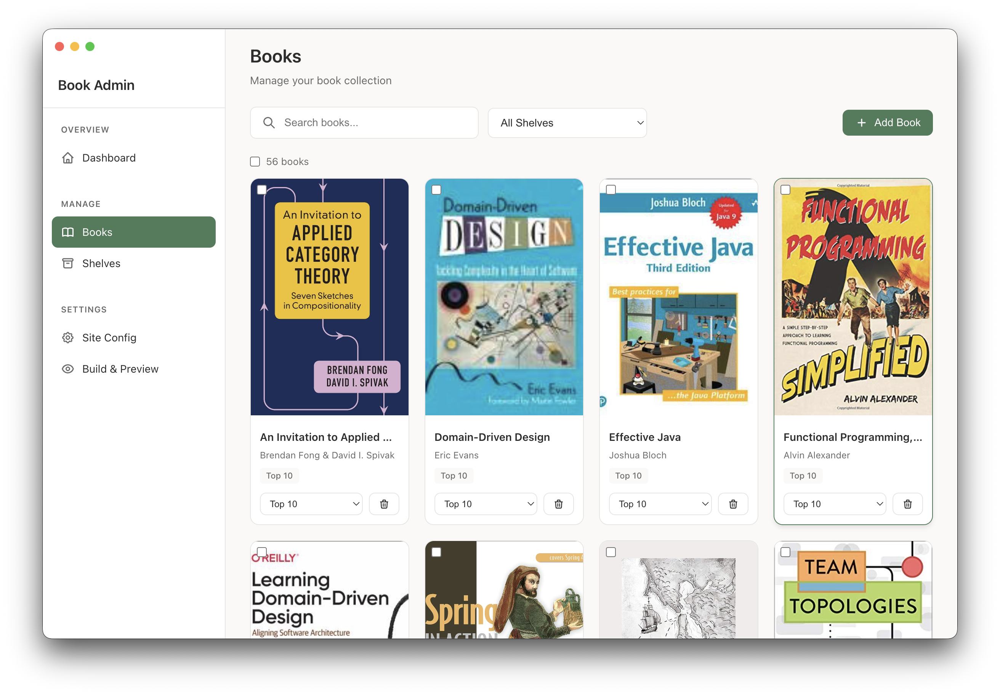
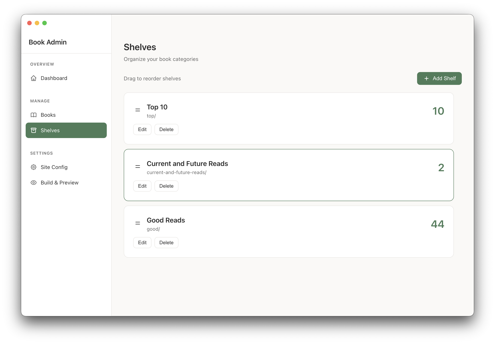
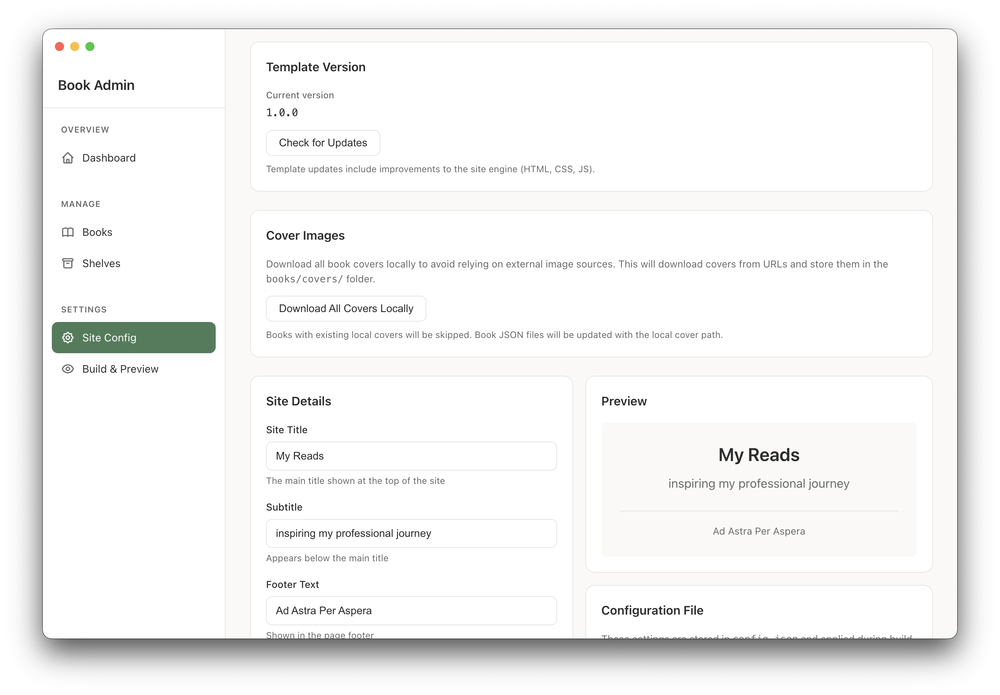

# My Reads

[](https://github.com/nycjv321/recommended-books/releases)
[](https://github.com/nycjv321/recommended-books/actions/workflows/release.yml)
[](https://opensource.org/licenses/MIT)
[]()
[](https://claude.ai)

A minimalist static website admin tool and site generator to showcase book recommendations, with an Electron desktop app for management.

## Example

See [Javier's Recommended Books](https://github.com/nycjv321/javiers-recommended-books.git) for a live example.

## Features

**Website**: Clean design, customizable shelves, dark mode, responsive layout, book detail overlays

**Admin App**:
- Create new sites or open existing ones
- Open Library search for book metadata
- Drag-and-drop shelf organization
- Download covers locally for offline/cached images
- Built-in preview server
- Template version tracking and updates

## Screenshots

| Manage Books | Shelf Management | Site Config |
|:---:|:---:|:---:|
|  |  |  |

## Quick Start

```bash
# Install dependencies
npm install

# Start the admin app
npm run dev
```

On first launch, choose:
- **Create New Site**: Select an empty folder and the admin will set up a complete site with templates and data structure
- **Open Existing Site**: Select a folder with an existing site (e.g., `packages/site`)

Use the admin app to add books, organize shelves, build, and preview your site.

For detailed workflow and deployment instructions, see **[docs/workflow.md](docs/workflow.md)**.

## Project Structure

```
recommended-books/
├── packages/
│   ├── admin/          # Electron admin app (React + TypeScript)
│   └── site/           # Static website (vanilla JS)
│       ├── books/      # Your book data (JSON files)
│       ├── config.json # Site configuration
│       └── dist/       # Build output (deploy this)
└── docs/               # Documentation
```

## Book JSON Schema

| Field | Type | Required | Description |
|-------|------|----------|-------------|
| `title` | string | Yes | Book title |
| `author` | string | Yes | Author name |
| `category` | string | No | Genre or category |
| `publishDate` | string | No | ISO date (YYYY-MM-DD) |
| `pages` | number | No | Page count |
| `cover` | string | No | URL to cover image |
| `coverLocal` | string | No | Local path (e.g., `covers/my-book.jpg`) |
| `notes` | string | No | Your personal notes |
| `link` | string | No | External URL |
| `clickBehavior` | string | No | `"overlay"` (default) or `"redirect"` |

**Cover Images**: You can use remote URLs (`cover`) or local files (`coverLocal`). Use the "Download All Covers Locally" feature in Site Config to cache all remote covers locally—this updates books to use `coverLocal` and avoids relying on external image sources.

## Customization

### Site Text

Edit in the admin app's Site Config page, or directly in `packages/site/config.json`:

```json
{
  "siteTitle": "My Reads",
  "siteSubtitle": "Books that shaped my career",
  "footerText": "Books I love and books to explore",
  "shelves": [
    { "id": "top5", "label": "Top 5 Reads", "folder": "top-5-reads" }
  ]
}
```

### Colors

Edit CSS variables in `packages/site/styles-minimalist.css`:

```css
:root {
    --bg-primary: #FAF5FF;
    --accent: #292524;
    --text-primary: #292524;
}
```

## Releases

Pre-built admin app binaries are available on the [Releases](../../releases) page for macOS, Windows, and Linux.

Releases are automated—trigger via **Actions** → **Release** → **Run workflow** and select the version bump type.

### Building from Source

```bash
npm install
cd packages/admin
npm run package        # Build for current platform
npm run package:mac    # macOS (DMG, ZIP)
npm run package:win    # Windows (NSIS installer, portable)
npm run package:linux  # Linux (AppImage, DEB)
```

### Deploying Your Site

After creating and building your site with the admin app, deploy the `dist/` folder to any static hosting (GitHub Pages, Netlify, S3, etc.).

See **[docs/workflow.md](docs/workflow.md)** for detailed deployment options.

## License

MIT
